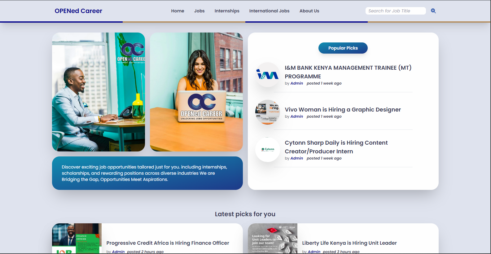

## OPENED CAREER WEBSITE

## Table of contents

- [Overview](#overview)
    - [Introduction](#introduction)
- [Process + Development](#process--development)
    - [Development](#development)
- [Link](#link)
- [Author](#author)

## Overview
### Introduction
- Responsive website utilizing Tailwind CSS for a sleek and modern design, integrated with WordPress backend, leveraging PHP for robust functionality and easy content management.
- It is a platform where job seekers are able to locate different career opportunites. Showcases different job roles and positions offered by companies, organisations or individuals.

## Process + Development
### Development
- Tailwind CSS
- PHP
- Wordpress Intergration ( Backend )
- SEO Optimization

## Link
- [Opened Career Website](https://openedcareer.com/)

## Author
- [Momanyi Brian](https://portfolio-momanyi-brian.vercel.app)